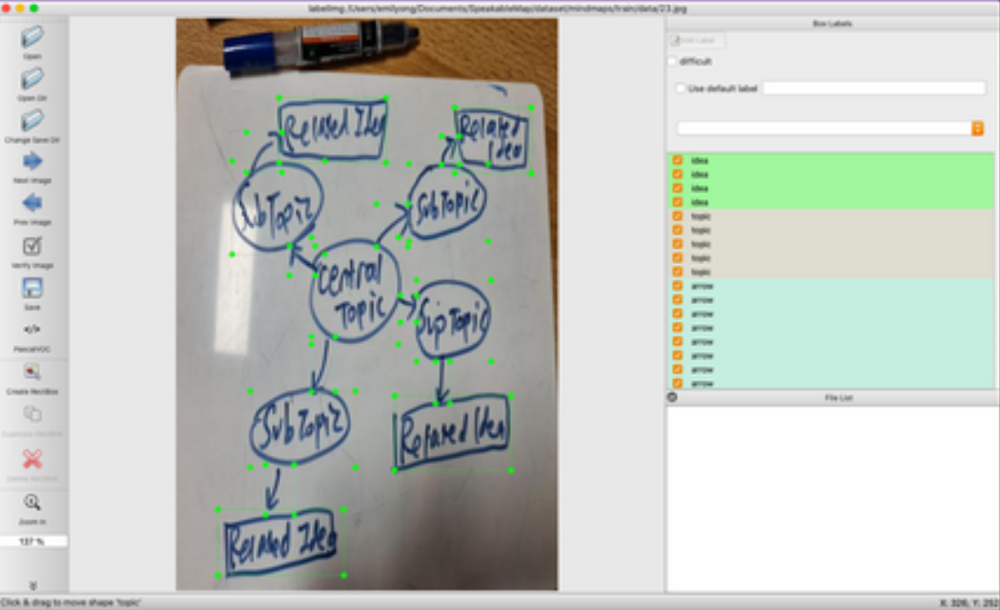

# Speakable Maps

Project Timeline: 30th November to 5th December

[Project Report](docs/ProjectReport.pdf)

[Project Slides](docs/ProjectSlides.pdf)

## Introduction

A mind map is a non-linear visual representation of concepts, often originating from a single idea and explicitly showcases the relationships between various concepts. However, one problem is that it is hard for the blind to interact with mind maps.

## Proposed Solution

The proposed solution defined in this project takes a sketch/image of a mind map and converts it to interactive elements on a HTML canvas, which supports mind-mapping and text-to-speech. To generalise the structure of a mind map, we define three key features:

1. Ellipse (to represent a main topic/sub-topic)


2. Rectangle (to represent an idea)


3. Arrows/Lines (to represent connections between nodes)


An example of a defined mind map:


## Data Collection

An immediate solution for the training data would be [“Google’s Quick, Draw!”​](https://quickdraw.withgoogle.com/data) dataset, which contains numerous labelled data files of the required object classes (ellipse, rectangle, line). However, it is not fully representative of a mind map, as the ellipses and rectangles are non-empty, and possibly contain text/scribbles.

Therefore, we created our own dataset, containing 30 different images, of which 10 images are taken from the internet and 20 images are hand-drawn. The hand-drawn images consist of a mixture of marker ink and pen ink to reflect the differences in brush sizes.

## Data Processing

### Image Labelling

To annotate the images, we use an open-source software [LabelImg​](​https://github.com/tzutalin/labelImg) ​, and create bounding boxes for each feature in the image.



### Image Compressing

To speed up training, we reduce the resolution of the image files.

### Data Split

80% of the data (24) is used for training, while 20% of the data (6) is used for testing.

[Training Dataset](dataset/mindmaps/train)

[Testing Dataset](dataset/mindmaps/test)

## Training

To predict the location of the object along with its class, we use object detection techniques. Object detection is modelled as a classification problem, where a sliding window is used to classify possible objects within the given area.

Hence, it is possible to know both the class and location of the objects in the image.

However, as the objects can be of varying sizes, an image pyramid is created by scaling the image until it fits within the chosen window size.


Image is taken from [cv-tricks](https://cv-tricks.com/object-detection/faster-r-cnn-yolo-ssd/)

To be able to classify objects within an image, a convolutional neural network (CNN) is used. Due to the slowness and computational complexity of CNN, RCNN is developed to use selective search to reduce the number of bounding boxes that are fed to the classifier, based on certain properties of the area within the image (e.g. texture, intensity, colour).

In Faster RCNN, selective search is replaced with a very small convolutional network called the Region Proposal Network to generate regions of interest, and uses anchor boxes to handle the variations in aspect ratio and object scale.


Image is taken from [cv-tricks](https://cv-tricks.com/object-detection/faster-r-cnn-yolo-ssd/)

In comparison to other models, the Faster RCNN model achieved the highest accuracy, albeit at a slower speed, which is a reasonable trade-off for this project.

Thus, we use the Tensorflow Object Detection API (Application Programming Interface), with the Faster RCNN (Region-based Convolutional Neural Network) Inception Resnet model.

## Text Recognition


To generate the bounding boxes, we use the ```visualize_boxes_and_labels_on_image_array``` ​helper from the object_detection library, which generates 100 possible detection boxes. We selectively filter the detection boxes based on a predefined threshold to obtain detection boxes with a reasonable level of accuracy. The image is then cropped using the coordinates of the bounding box and converted to grayscale. We use the Google Cloud Vision API to recognise the text within the image.

## Mindmap

For each of the chosen bounding boxes containing arrows, we compute the error for that bounding box in relation to other bounding boxes containing either topics or ideas. To compute the error, we treat the bounding box containing the arrow as the origin, and calculate the Euclidean Distance between the two points (red line). Then, we store an array of all the connections.


On the front-end, we use [Fabric.JS](http://fabricjs.com/) to provide helpers to generate shapes and text on the canvas, while the visualisation code for the mind map is self-coded.

## Speech Synthesis

To provide ease of use for the blind, we define a shift+hover action that will sound out the text in the hovered node and all other nodes connected to it.

## Front-End Design

### Libraries
- jQuery
- Bulma.CSS
- Fabric.JS

### Main screen


### Loading screen


### Mindmap screen


### Result screen


To view more results, click [here](docs/images/results).

### Useful Features
- Local Storage support by clicking on the save button
- Actions:
  - Create new topic/idea by clicking on the respective buttons
  - Double click on nodes to edit text
  - Shift+click on arrows to delete connections
  - To create new connections, click on arrow and then click on two different nodes
  - Move, rotate, delete and scale shapes (by Fabric.JS)


## References

### Training
https://tensorflow-object-detection-api-tutorial.readthedocs.io/en/latest/training.html#

### Images used
https://www.mindtools.com/media/Diagrams/MindMaps_Figure3.png

https://i.pinimg.com/originals/0c/a7/36/0ca73645f1e17777832d0b9d17e224d9.png

https://thesweetsetup.com/wp-content/uploads/2018/03/4-basicmindmap.jpg

https://d2slcw3kip6qmk.cloudfront.net/marketing/pages/chart/examples/brainstorming-map.svg

https://d3n817fwly711g.cloudfront.net/uploads/2012/08/Mind-map-example-How-To-Defeat-Superman-1280x720.png

https://www.canr.msu.edu/contentAsset/image/8c122bc7-efa6-4dcd-a92a-7d83d2106c39/fileAsset/filter/Resize,Jpeg/resize_w/750/jpeg_q/80

https://www.abeuk.com/sites/default/files/styles/full_width/public/files/BF3MM.png?itok=arBNCUUW

https://simon513313.files.wordpress.com/2014/11/shapes-large.jpg

https://d2slcw3kip6qmk.cloudfront.net/marketing/pages/chart/examples/health-mind-map.svg

https://d2slcw3kip6qmk.cloudfront.net/marketing/pages/chart/examples/physics-mind-map.png

### Useful commands
#### Training
```bash
python3 model_main_tf2.py --model_dir=models/faster_rcnn_inception_resnet_v2_1024x1024_coco17_tpu-8 --pipeline_config_path=models/faster_rcnn_inception_resnet_v2_1024x1024_coco17_tpu-8/pipeline.config
```

#### Evaluation
```bash
python3 model_main_tf2.py --model_dir=models/faster_rcnn_inception_resnet_v2_1024x1024_coco17_tpu-8 --pipeline_config_path=models/faster_rcnn_inception_resnet_v2_1024x1024_coco17_tpu-8/pipeline.config --checkpoint_dir=models/faster_rcnn_inception_resnet_v2_1024x1024_coco17_tpu-8
```

#### Exporting
```bash
python3 exporter_main_v2.py \
    --input_type image_tensor \
    --pipeline_config_path models/faster_rcnn_inception_resnet_v2_1024x1024_coco17_tpu-8/pipeline.config \
    --trained_checkpoint_dir models/faster_rcnn_inception_resnet_v2_1024x1024_coco17_tpu-8 \
    --output_directory exported-models/faster_rcnn_inception_resnet_v2_1024x1024_coco17_tpu-8
```

#### Flask
https://flask.palletsprojects.com/en/1.1.x/installation/
```bash
. venv/bin/activate
```
